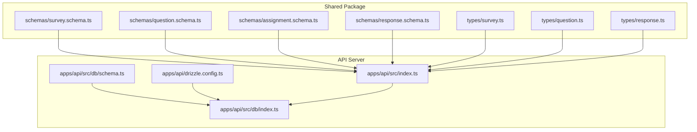
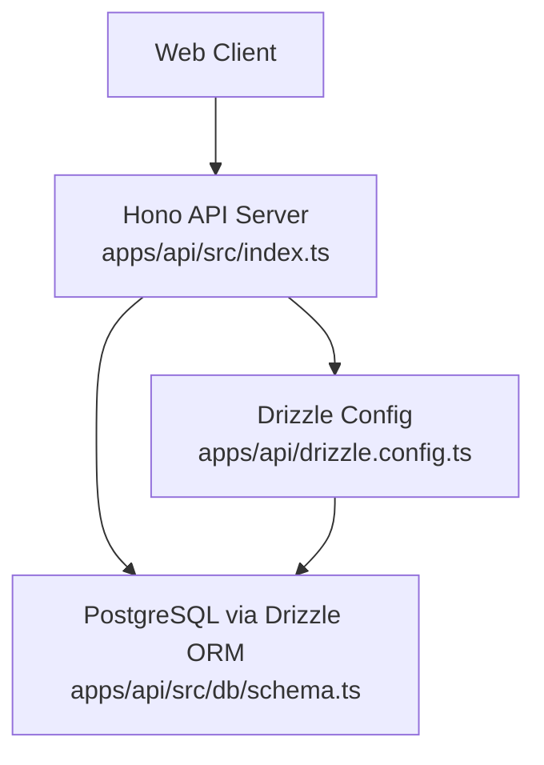
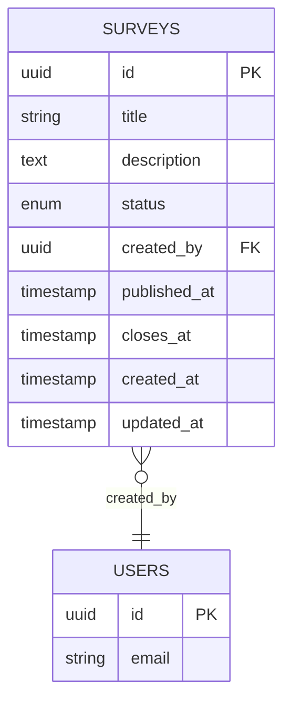
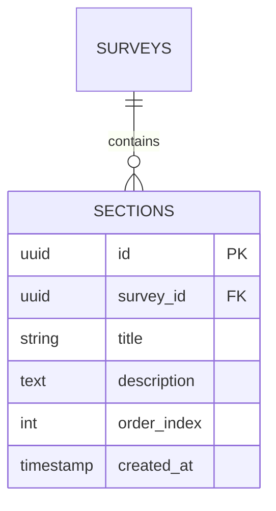
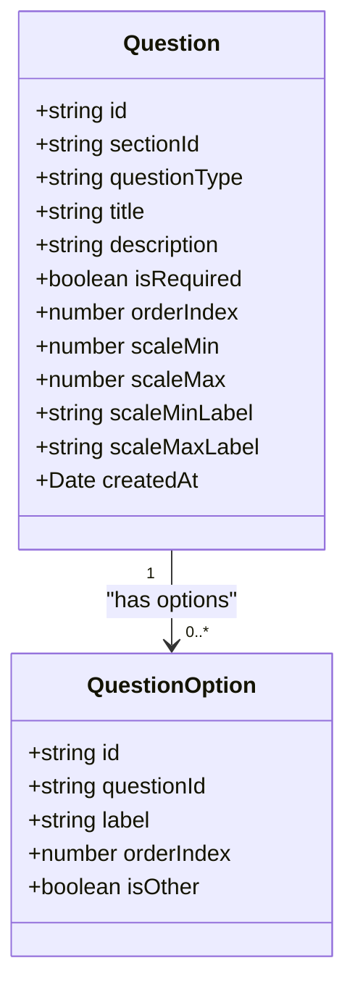
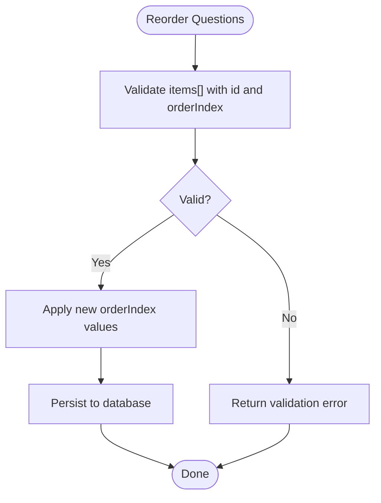
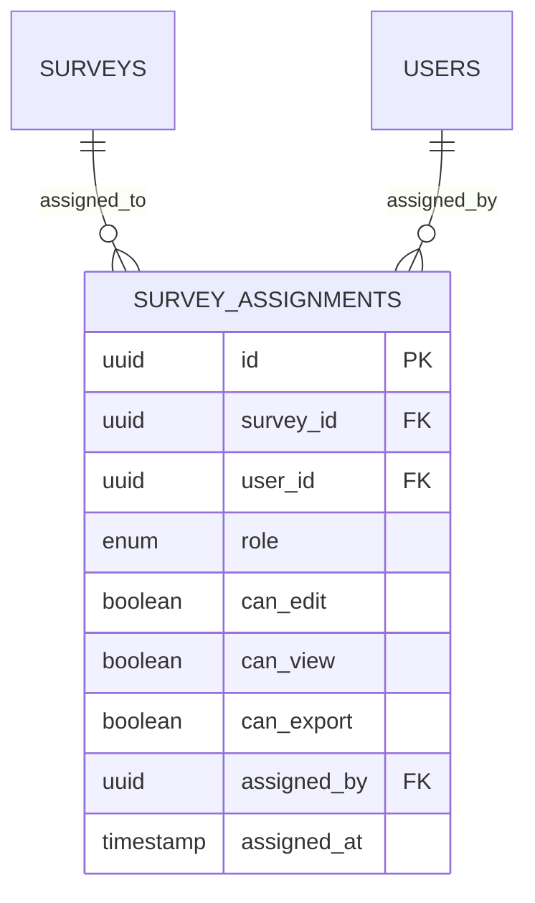
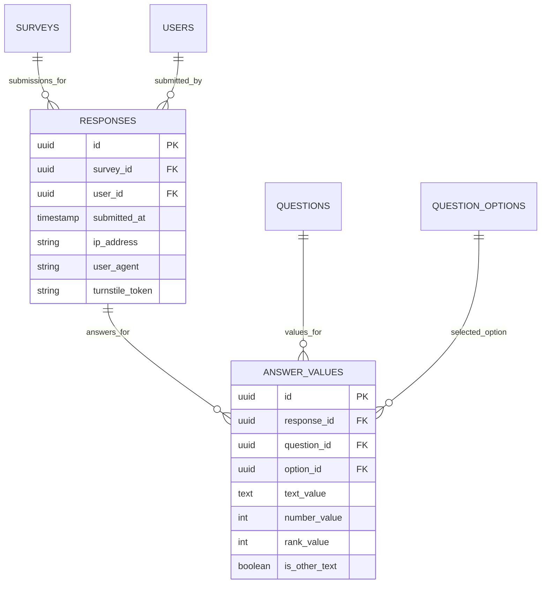
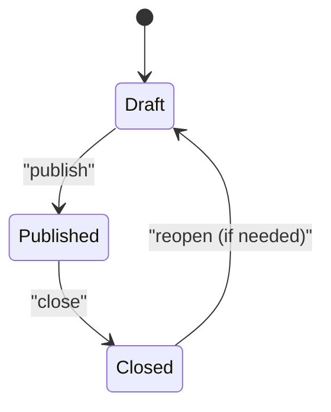
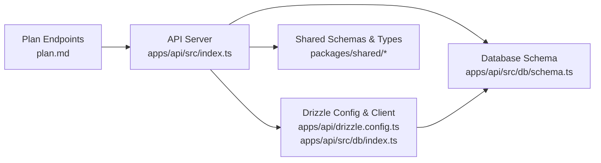

# Survey Management System

<cite>
**Referenced Files in This Document**
- [survey.schema.ts](file://packages/shared/src/schemas/survey.schema.ts)
- [question.schema.ts](file://packages/shared/src/schemas/question.schema.ts)
- [assignment.schema.ts](file://packages/shared/src/schemas/assignment.schema.ts)
- [response.schema.ts](file://packages/shared/src/schemas/response.schema.ts)
- [survey.ts](file://packages/shared/src/types/survey.ts)
- [question.ts](file://packages/shared/src/types/question.ts)
- [response.ts](file://packages/shared/src/types/response.ts)
- [schema.ts](file://apps/api/src/db/schema.ts)
- [index.ts](file://apps/api/src/index.ts)
- [drizzle.config.ts](file://apps/api/drizzle.config.ts)
- [db.index.ts](file://apps/api/src/db/index.ts)
- [plan.md](file://plan.md)
</cite>

## Table of Contents
1. [Introduction](#introduction)
2. [Project Structure](#project-structure)
3. [Core Components](#core-components)
4. [Architecture Overview](#architecture-overview)
5. [Detailed Component Analysis](#detailed-component-analysis)
6. [Dependency Analysis](#dependency-analysis)
7. [Performance Considerations](#performance-considerations)
8. [Troubleshooting Guide](#troubleshooting-guide)
9. [Conclusion](#conclusion)
10. [Appendices](#appendices)

## Introduction
This document describes the survey management system with a focus on survey creation, editing, and organization. It explains survey type definitions, status management (draft, published, closed), section organization patterns, and the 12 supported question types. It also documents question option management, ordering systems, validation constraints, the survey assignment system for role-based permissions and access control, practical creation workflows, status transitions, lifecycle management, duplicate prevention, and data export capabilities. The complete survey data model and relationship patterns are included.

## Project Structure
The system is organized into shared TypeScript packages and application modules:
- Shared schemas and types define validation and data contracts for surveys, questions, assignments, and responses.
- The API server module defines the backend runtime, middleware, and route placeholders for survey administration and public endpoints.
- The database schema defines the persistent entities and relationships.

**Diagram sources**
- [survey.schema.ts:1-22](file://packages/shared/src/schemas/survey.schema.ts#L1-L22)
- [question.schema.ts:1-65](file://packages/shared/src/schemas/question.schema.ts#L1-L65)
- [assignment.schema.ts:1-20](file://packages/shared/src/schemas/assignment.schema.ts#L1-L20)
- [response.schema.ts:1-24](file://packages/shared/src/schemas/response.schema.ts#L1-L24)
- [survey.ts:1-50](file://packages/shared/src/types/survey.ts#L1-L50)
- [question.ts:1-66](file://packages/shared/src/types/question.ts#L1-L66)
- [response.ts:1-53](file://packages/shared/src/types/response.ts#L1-L53)
- [schema.ts:1-247](file://apps/api/src/db/schema.ts#L1-L247)
- [index.ts:1-67](file://apps/api/src/index.ts#L1-L67)
- [drizzle.config.ts:1-11](file://apps/api/drizzle.config.ts#L1-L11)
- [db.index.ts:1-9](file://apps/api/src/db/index.ts#L1-L9)

**Section sources**
- [index.ts:1-67](file://apps/api/src/index.ts#L1-L67)
- [schema.ts:1-247](file://apps/api/src/db/schema.ts#L1-L247)
- [drizzle.config.ts:1-11](file://apps/api/drizzle.config.ts#L1-L11)
- [db.index.ts:1-9](file://apps/api/src/db/index.ts#L1-L9)

## Core Components
- Survey schemas and types define survey metadata, status, and relationships to sections and responses.
- Question schemas and types define question attributes, options, and ordering.
- Assignment schemas and types define role-based permissions for survey access.
- Response schemas and types define submission payloads and statistics structures.
- Database schema defines the persistent entities and foreign key relationships.

Key capabilities:
- Survey lifecycle: draft → published → closed.
- Section organization: ordered groups of questions.
- Question types: 12 distinct types with optional validation and options.
- Ordering: per-section question ordering and bulk reordering.
- Access control: editor/viewer roles with granular permissions.
- Submission validation: structured payloads with constraints.
- Export: CSV export endpoint for administrators.

**Section sources**
- [survey.schema.ts:1-22](file://packages/shared/src/schemas/survey.schema.ts#L1-L22)
- [question.schema.ts:1-65](file://packages/shared/src/schemas/question.schema.ts#L1-L65)
- [assignment.schema.ts:1-20](file://packages/shared/src/schemas/assignment.schema.ts#L1-L20)
- [response.schema.ts:1-24](file://packages/shared/src/schemas/response.schema.ts#L1-L24)
- [survey.ts:1-50](file://packages/shared/src/types/survey.ts#L1-L50)
- [question.ts:1-66](file://packages/shared/src/types/question.ts#L1-L66)
- [response.ts:1-53](file://packages/shared/src/types/response.ts#L1-L53)
- [schema.ts:1-247](file://apps/api/src/db/schema.ts#L1-L247)

## Architecture Overview
The system follows a layered architecture:
- Presentation layer: Web client (not analyzed here) interacts with API endpoints.
- API layer: Hono server with middleware for logging, CORS, security headers, timeouts, and error handling.
- Persistence layer: PostgreSQL via Drizzle ORM with enums and indexes for performance.

**Diagram sources**
- [index.ts:1-67](file://apps/api/src/index.ts#L1-L67)
- [schema.ts:1-247](file://apps/api/src/db/schema.ts#L1-L247)
- [drizzle.config.ts:1-11](file://apps/api/drizzle.config.ts#L1-L11)

## Detailed Component Analysis

### Survey Model and Status Management
Surveys have metadata, status, and lifecycle timestamps. Status transitions are constrained to draft, published, and closed. Validation ensures title length and optional close datetime.

**Diagram sources**
- [schema.ts:57-69](file://apps/api/src/db/schema.ts#L57-L69)
- [schema.ts:41-51](file://apps/api/src/db/schema.ts#L41-L51)
- [survey.schema.ts:3-17](file://packages/shared/src/schemas/survey.schema.ts#L3-L17)
- [survey.ts:5-15](file://packages/shared/src/types/survey.ts#L5-L15)

Practical workflow:
- Create survey: title and optional description and closesAt.
- Update survey: partial updates to title, description, closesAt.
- Update status: transition from draft to published or close.

Validation constraints:
- Title min/max lengths enforced in both schema and type definitions.
- Status enum restricted to draft, published, closed.

**Section sources**
- [survey.schema.ts:3-17](file://packages/shared/src/schemas/survey.schema.ts#L3-L17)
- [survey.ts:5-15](file://packages/shared/src/types/survey.ts#L5-L15)
- [schema.ts:57-69](file://apps/api/src/db/schema.ts#L57-L69)

### Section Organization Patterns
Sections group questions within a survey and maintain order. Each section has a title, optional description, and an order index.

**Diagram sources**
- [schema.ts:105-120](file://apps/api/src/db/schema.ts#L105-L120)
- [survey.ts:22-33](file://packages/shared/src/types/survey.ts#L22-L33)

Ordering:
- Sections are ordered by orderIndex.
- Bulk reordering is supported via a dedicated endpoint and schema.

**Section sources**
- [schema.ts:105-120](file://apps/api/src/db/schema.ts#L105-L120)
- [survey.ts:22-33](file://packages/shared/src/types/survey.ts#L22-L33)

### Question Types and Options
There are 12 question types with shared attributes and optional validations. Options support ordering and “other” selections.

**Diagram sources**
- [question.ts:30-55](file://packages/shared/src/types/question.ts#L30-L55)
- [question.schema.ts:18-39](file://packages/shared/src/schemas/question.schema.ts#L18-L39)

Supported question types:
- Text: short_text, long_text
- Choice: single_choice, multiple_choice, dropdown
- Scale: linear_scale, rating
- Boolean: yes_no
- Date/Number: date, number
- Ranking: ranking
- Matrix: matrix

Constraints:
- Title length limits.
- Scale min/max range and labels.
- Options array with label length and isOther flag.
- Ordering via orderIndex and bulk reorder schema.

**Section sources**
- [question.ts:1-66](file://packages/shared/src/types/question.ts#L1-L66)
- [question.schema.ts:3-48](file://packages/shared/src/schemas/question.schema.ts#L3-L48)

### Question Option Management and Ordering
Options are managed per question with label and orderIndex. Bulk reordering is supported.

**Diagram sources**
- [question.schema.ts:41-48](file://packages/shared/src/schemas/question.schema.ts#L41-L48)

**Section sources**
- [question.schema.ts:50-58](file://packages/shared/src/schemas/question.schema.ts#L50-L58)

### Assignment System and Access Control
Assignments grant roles and permissions to users for a specific survey. Roles include editor and viewer. Permissions include canEdit, canView, and canExport.

**Diagram sources**
- [schema.ts:75-99](file://apps/api/src/db/schema.ts#L75-L99)
- [schema.ts:41-51](file://apps/api/src/db/schema.ts#L41-L51)
- [assignment.schema.ts:3-16](file://packages/shared/src/schemas/assignment.schema.ts#L3-L16)
- [survey.ts:37-49](file://packages/shared/src/types/survey.ts#L37-L49)

Access control patterns:
- Editor role can edit survey content.
- Viewer role can view but not edit.
- canExport permission enables CSV export.

**Section sources**
- [assignment.schema.ts:3-16](file://packages/shared/src/schemas/assignment.schema.ts#L3-L16)
- [survey.ts:37-49](file://packages/shared/src/types/survey.ts#L37-L49)
- [schema.ts:75-99](file://apps/api/src/db/schema.ts#L75-L99)

### Responses and Submission Validation
Responses capture submissions per user per survey. Answer values vary by question type.

**Diagram sources**
- [schema.ts:173-196](file://apps/api/src/db/schema.ts#L173-L196)
- [schema.ts:202-222](file://apps/api/src/db/schema.ts#L202-L222)
- [response.ts:1-53](file://packages/shared/src/types/response.ts#L1-L53)
- [response.schema.ts:3-20](file://packages/shared/src/schemas/response.schema.ts#L3-L20)

Submission constraints:
- Turnstile token required.
- Answers array minimum/maximum counts.
- Payload shape validated per question type.

Duplicate prevention:
- Unique index prevents multiple responses per user per survey.

**Section sources**
- [response.ts:1-53](file://packages/shared/src/types/response.ts#L1-L53)
- [response.schema.ts:3-20](file://packages/shared/src/schemas/response.schema.ts#L3-L20)
- [schema.ts:173-196](file://apps/api/src/db/schema.ts#L173-L196)

### Survey Lifecycle Management
Lifecycle states and transitions:
- draft: initial state for editing.
- published: visible to respondents.
- closed: no further submissions.

[No sources needed since this diagram shows conceptual workflow, not actual code structure]

### Practical Creation Workflows
Example workflows (conceptual):
- Create survey: provide title, optional description and closesAt; status defaults to draft.
- Add sections: create sections with titles and orderIndex; reorder sections if needed.
- Add questions: choose questionType, set title and optional description; configure scale/rating if applicable; add options for choice types.
- Manage options: create/update/delete options; reorder options within a question.
- Publish survey: update status to published; optionally set publishedAt.
- Close survey: update status to closed; optionally set closesAt.

[No sources needed since this section provides general guidance]

### Status Transitions and Validation
- Status update schema restricts values to draft, published, closed.
- Update operations allow nullable closesAt for flexible scheduling.

**Section sources**
- [survey.schema.ts:9-17](file://packages/shared/src/schemas/survey.schema.ts#L9-L17)

### Duplicate Prevention and Data Export
- Unique constraint on (surveyId, userId) in responses prevents duplicate submissions.
- CSV export endpoint exists for administrators.

**Section sources**
- [schema.ts:189-192](file://apps/api/src/db/schema.ts#L189-L192)
- [plan.md](file://plan.md#L505)

## Dependency Analysis
The API server depends on shared schemas and types, and connects to the database via Drizzle ORM. Routes are defined in the plan and will be implemented to handle survey CRUD, status updates, section/question management, assignments, responses, stats, and exports.

**Diagram sources**
- [plan.md:471-514](file://plan.md#L471-L514)
- [index.ts:1-67](file://apps/api/src/index.ts#L1-L67)
- [schema.ts:1-247](file://apps/api/src/db/schema.ts#L1-L247)
- [drizzle.config.ts:1-11](file://apps/api/drizzle.config.ts#L1-L11)
- [db.index.ts:1-9](file://apps/api/src/db/index.ts#L1-L9)

**Section sources**
- [plan.md:471-514](file://plan.md#L471-L514)
- [index.ts:1-67](file://apps/api/src/index.ts#L1-L67)
- [schema.ts:1-247](file://apps/api/src/db/schema.ts#L1-L247)

## Performance Considerations
- Indexes on foreign keys and frequently queried columns improve lookup performance.
- Middleware sets request size limits and timeouts to protect the server.
- Enums reduce storage and improve query performance for status and roles.

[No sources needed since this section provides general guidance]

## Troubleshooting Guide
Common issues and resolutions:
- Validation errors: Ensure inputs match schema constraints (lengths, enums, numeric ranges).
- Authentication/authorization: Verify assignment role and permissions for requested actions.
- Duplicate submissions: Check unique index on responses; prevent multiple submissions per user per survey.
- Export permissions: Confirm canExport is enabled for the requesting user.

**Section sources**
- [question.schema.ts:18-39](file://packages/shared/src/schemas/question.schema.ts#L18-L39)
- [assignment.schema.ts:3-16](file://packages/shared/src/schemas/assignment.schema.ts#L3-L16)
- [schema.ts:189-192](file://apps/api/src/db/schema.ts#L189-L192)

## Conclusion
The survey management system provides a robust foundation for creating, organizing, and managing surveys with strong validation, role-based access control, and lifecycle management. The data model supports ordered sections and questions, flexible question types, and structured responses suitable for analytics and export.

## Appendices

### Endpoint Reference (from plan)
- Public
  - GET /api/surveys
  - GET /api/surveys/:id
  - GET /api/surveys/:id/my-response
  - POST /api/surveys/:id/responses
- Admin
  - GET /api/admin/surveys
  - POST /api/admin/surveys
  - PATCH /api/admin/surveys/:id
  - DELETE /api/admin/surveys/:id
  - PATCH /api/admin/surveys/:id/status
  - GET /api/admin/surveys/:id/sections
  - POST /api/admin/surveys/:id/sections
  - PATCH /api/admin/sections/:id
  - DELETE /api/admin/sections/:id
  - PUT /api/admin/surveys/:id/sections/reorder
  - GET /api/admin/sections/:id/questions
  - POST /api/admin/sections/:id/questions
  - PATCH /api/admin/questions/:id
  - DELETE /api/admin/questions/:id
  - PUT /api/admin/sections/:id/questions/reorder
  - POST /api/admin/questions/:id/options
  - PATCH /api/admin/options/:id
  - DELETE /api/admin/options/:id
  - GET /api/admin/surveys/:id/responses
  - GET /api/admin/surveys/:id/stats
  - GET /api/admin/surveys/:id/export/csv
  - GET /api/admin/users
  - PATCH /api/admin/users/:id/role
  - POST /api/admin/surveys/:id/assignments
  - PATCH /api/admin/assignments/:id
  - DELETE /api/admin/assignments/:id
  - GET /api/admin/activity-log

**Section sources**
- [plan.md:471-514](file://plan.md#L471-L514)